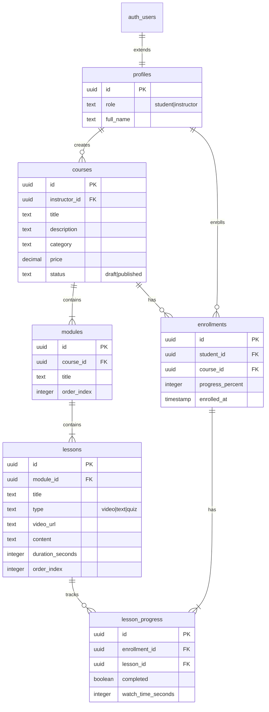

# Database Schema - MVP #5: Plataforma de E-Learning

## ERD



## Tables

### 1. `courses`

- `id`: UUID PRIMARY KEY
- `instructor_id`: UUID REFERENCES profiles(id)
- `title`: TEXT NOT NULL
- `description`: TEXT
- `category`: TEXT
- `price`: DECIMAL(10,2)
- `thumbnail_url`: TEXT
- `status`: TEXT CHECK (IN 'draft', 'published') DEFAULT 'draft'
- `created_at`: TIMESTAMP

**Indexes**: `idx_courses_instructor`, `idx_courses_status`

### 2. `modules`

- `id`: UUID PRIMARY KEY
- `course_id`: UUID REFERENCES courses(id) ON DELETE CASCADE
- `title`: TEXT NOT NULL
- `order_index`: INTEGER NOT NULL
- Unique (course_id, order_index)

### 3. `lessons`

- `id`: UUID PRIMARY KEY
- `module_id`: UUID REFERENCES modules(id) ON DELETE CASCADE
- `title`: TEXT NOT NULL
- `type`: TEXT CHECK (IN 'video', 'text', 'quiz')
- `video_url`: TEXT
- `content`: TEXT (for text lessons)
- `duration_seconds`: INTEGER
- `order_index`: INTEGER NOT NULL

### 4. `enrollments`

- `id`: UUID PRIMARY KEY
- `student_id`: UUID REFERENCES profiles(id)
- `course_id`: UUID REFERENCES courses(id)
- `progress_percent`: INTEGER DEFAULT 0
- `enrolled_at`: TIMESTAMP DEFAULT NOW()
- Unique (student_id, course_id)

### 5. `lesson_progress`

- `id`: UUID PRIMARY KEY
- `enrollment_id`: UUID REFERENCES enrollments(id) ON DELETE CASCADE
- `lesson_id`: UUID REFERENCES lessons(id)
- `completed`: BOOLEAN DEFAULT false
- `watch_time_seconds`: INTEGER DEFAULT 0
- Unique (enrollment_id, lesson_id)

## RLS Policies

```sql
-- Courses: Public read, instructor manage
CREATE POLICY "Anyone can view published courses"
  ON courses FOR SELECT
  USING (status = 'published');

CREATE POLICY "Instructors can manage own courses"
  ON courses FOR ALL
  USING (instructor_id = auth.uid());

-- Enrollments: Student-scoped
CREATE POLICY "Students can view own enrollments"
  ON enrollments FOR SELECT
  USING (student_id = auth.uid());

CREATE POLICY "Students can enroll"
  ON enrollments FOR INSERT
  WITH CHECK (student_id = auth.uid());

-- Lesson progress: Enrollment-scoped
CREATE POLICY "Students can manage own progress"
  ON lesson_progress FOR ALL
  USING (
    enrollment_id IN (
      SELECT id FROM enrollments WHERE student_id = auth.uid()
    )
  );
```

**Last Updated**: 2026-01-13
