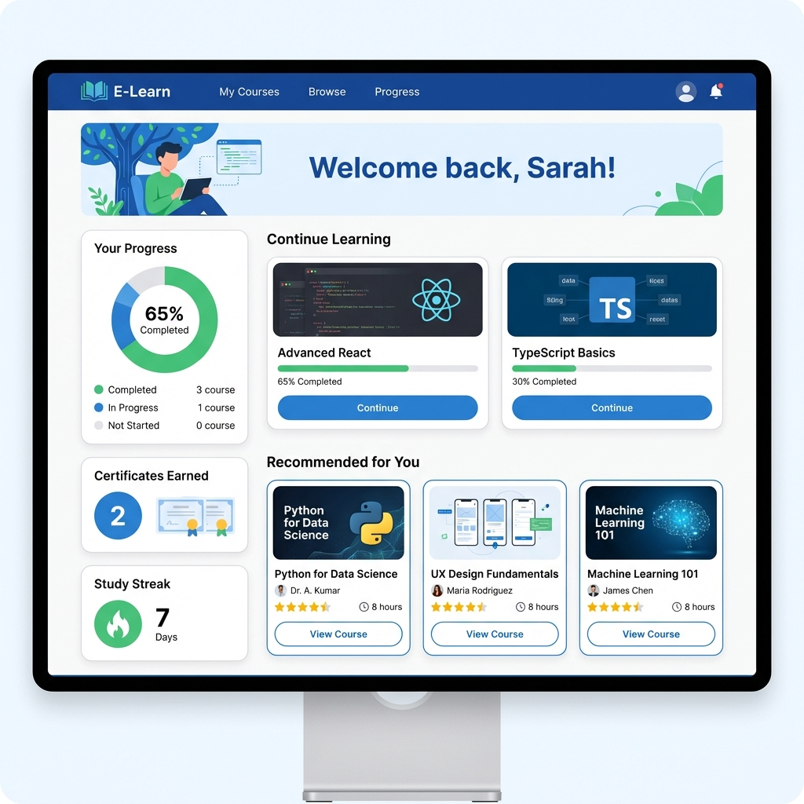
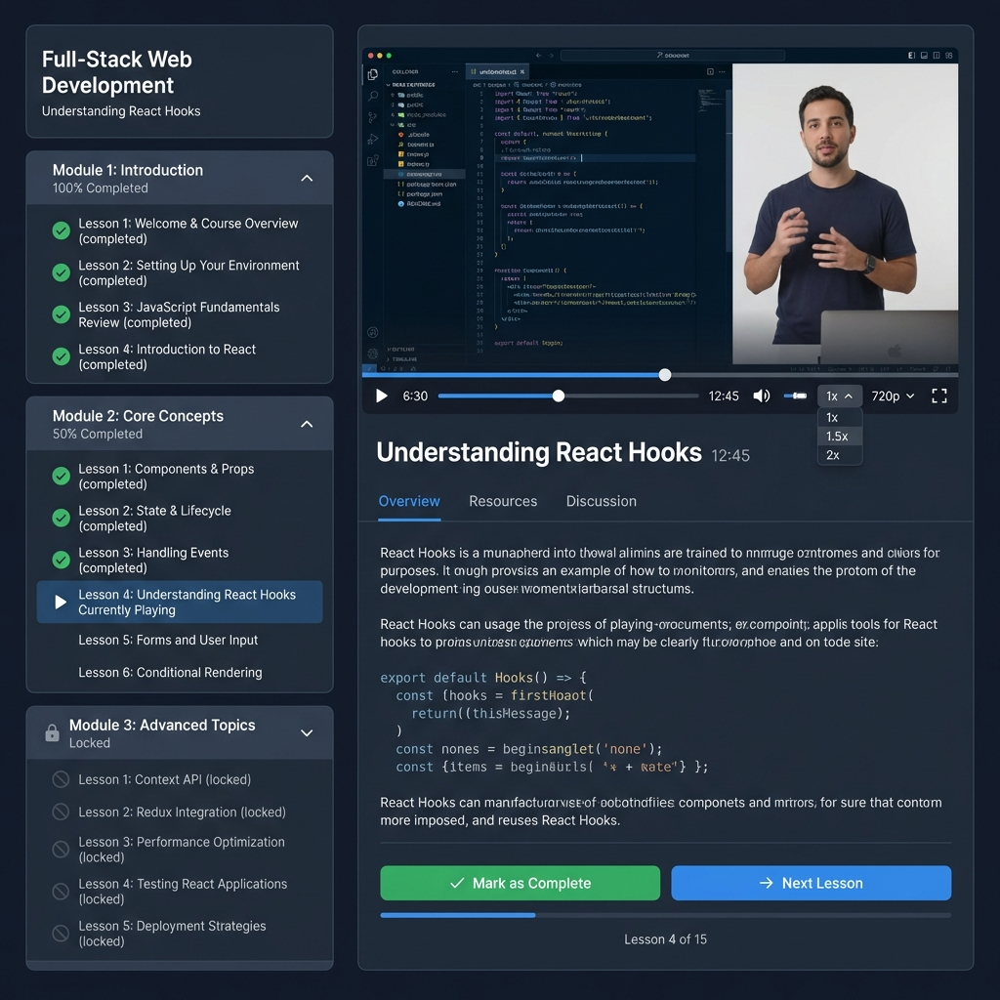
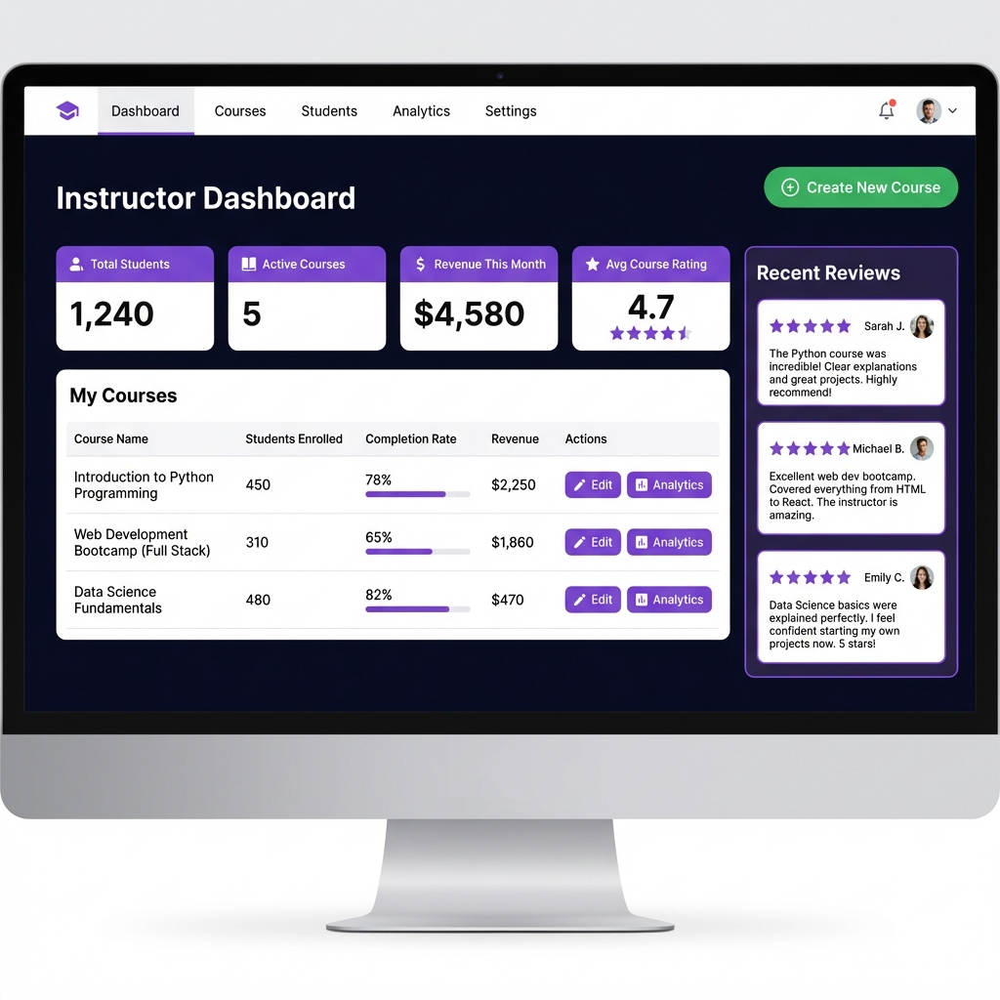
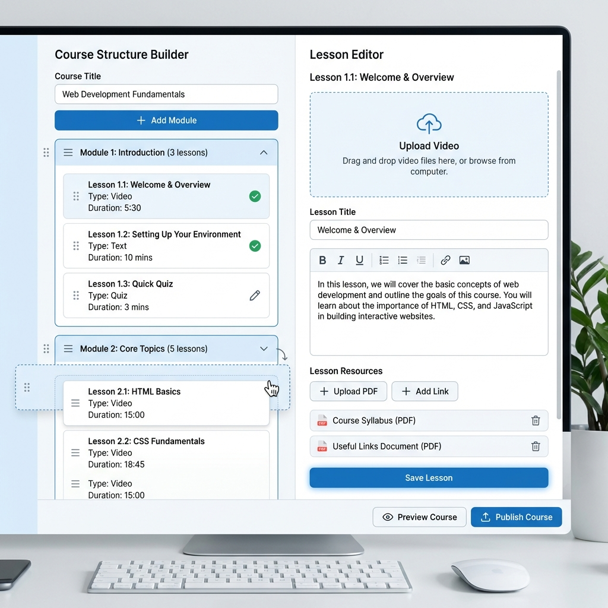

# Wireframes - MVP #5: Plataforma de E-Learning

---

## 1. Student Dashboard



**Components**:

- Welcome message with student name
- Continue Learning: 2 course cards with progress bars (65%, 30%)
- Recommended courses: 3 cards with thumbnails, instructor, rating, duration
- Sidebar: Progress pie chart (65% completion), Certificates earned (2), Study streak (7 days)

---

## 2. Course Player



**Components**:

- Left sidebar (30%): Course curriculum
  - Module 1: Introduction (4 lessons, all completed ✓)
  - Module 2: Core Concepts (6 lessons, lesson 4 playing ▶)
  - Module 3: Advanced (5 lessons, locked 🔒)
- Main video player (70%): Controls (play, seek, speed, quality, fullscreen)
- Tabs: Overview, Resources, Discussion
- Buttons: "Mark as Complete" (green), "Next Lesson" (blue)
- Progress: "Lesson 4 of 15"

---

## 3. Instructor Dashboard



**Components**:

- Stats cards: Total Students (1,240), Active Courses (5), Revenue ($4,580), Avg Rating (4.7 ⭐)
- My Courses table: Course name, Students enrolled, Completion rate, Revenue, Actions (Edit, Analytics)
- Recent Reviews sidebar: 3 student reviews with 5 stars
- "Create New Course" button (green, top right)

---

## 4. Course Builder



**Components**:

- Left panel (40%): Course structure
  - Course title input
  - "+Add Module" button
  - Expandable modules with drag handles
  - Lessons: title, type (Video/Quiz/Text), duration, drag handle
- Right panel (60%): Lesson editor
  - Upload video drag-and-drop zone
  - Lesson title input
  - Rich text editor for description
  - Lesson resources section (PDFs, links)
  - "Save Lesson" button
- Bottom: "Preview Course", "Publish Course" buttons

---

## Key User Flows

### Flow 1: Student Takes Course

```
Browse Courses → Enroll → Watch Video → Mark Complete → Next Lesson → Course Completed → Certificate
```

### Flow 2: Instructor Creates Course

```
Dashboard → Create Course → Add Modules → Add Lessons → Upload Videos → Publish → Students Enroll
```

---

## Responsive Behavior

- **Desktop**: Full sidebar + video player
- **Tablet**: Collapsible sidebar
- **Mobile**: Fullscreen video, swipe between lessons

---

## Accessibility

- Video controls keyboard accessible
- Closed captions support
- Screen reader announces progress
- High contrast mode for text

---

**Last Updated**: 2026-01-13  
**Images**: 4/4 ✅
